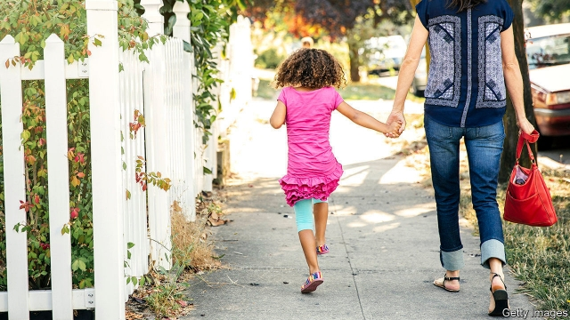

###### Help for the help

# A court rules au pairs must be treated on a par with other workers 

 

> print-edition iconPrint edition | United States | Dec 18th 2019 

“IT WAS CREEPY. I avoided any contact with the father…there were always periods where [I] didn’t get paid for a few weeks”, said an au pair quoted in a 2018 report on problems in the au-pair industry. The report, written by the International Human Rights Law Clinic at the American University, revealed that many au pairs endured illegally low wages and abuse. One au pair interviewed was forced to sleep in a dog’s play area. Another developed a bladder infection because she wasn’t permitted enough bathroom breaks. 

In America au pairs occupy a curious legal space. A State Department programme allows 20,000 young foreigners to spend a year or two in America to attend college classes while living with an American host family. In exchange for providing up to 45 hours of child care, they are paid a stipend of at least $195.75 a week, or $4.35 per hour. Critics say that the programme, which has little oversight, is rife with abuse. In early December, an appeals court in Massachusetts struck a blow for au pairs when it upheld a ruling that in a number of north-eastern states and Puerto Rico, they must be covered by the same protective laws that apply to other workers. 

Culture Care Au Pair, an agency that sponsors au pairs, had sued the state, hoping to exempt au pairs from rules for domestic workers passed in 2014. It claimed that au pairs are not typical workers as they are participating in a cultural and educational exchange programme. That argument was thrown out. In Massachusetts, that means au pairs must now be paid the minimum wage (soon to be $12.75 per hour), as well as guaranteed set meal breaks and the like. The court’s decision is the second defeat for the au pair industry. Earlier this year 10,000 au pairs were awarded $65.5m in a class action suit in Colorado. 

A large part of the appeal of employing an au pair is how much cheaper it is than other child care options. Nationwide, nannies cost on average $596 a week in 2018. In states like Massachusetts and New York they earn far more. The federal government defines “affordable” child care as no more than 7% of a family’s income. Over 40% of families spend more than 15% of income on care, according to Care.com, a website which helps people to find carers. Monique Tú Nguyen, head of Matahari Women Workers’ Centre, which protects low-wage earners, says the ruling is a “huge win for au pairs”. Parents might resent it, but they will have to stump up. 

