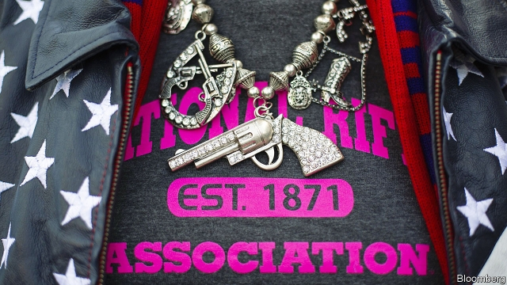

###### From our cold dead hands

# Rural Virginians rail against gun controls 

 

> print-edition iconPrint edition | United States | Dec 18th 2019 

RALPH NORTHAM, the governor of Virginia, has no plan to wrest guns from their owners. His proposed gun-control measures are far more modest. But the Virginians who gathered this month at a meeting of the board of supervisors of Augusta County, in the state’s rural west, were not buying that. The meeting included a vote on whether the county should declare itself a “Second Amendment sanctuary”. It was held at a high school to accommodate the crowd that was expected to show up. In the end, so many people came to protest against supposed Democratic plans to disarm them that they could not all fit in, and loudspeakers had to be set up outside for the latecomers. 

At least 60 of Virginia’s 95 counties have declared themselves Second Amendment sanctuaries in recent weeks. They follow counties in states such as Colorado and New Mexico. They have borrowed from the left the rhetoric of the “sanctuary cities” movement, where local governments limit their co-operation with federal immigration authorities in an attempt to protect illegal immigrants from deportation. But, in practice, for a county to declare itself a Second Amendment sanctuary is little more than a howl of rage from rural gun owners. 

In Virginia the movement began in November, when Democrats took control of both houses of the state’s legislature for the first time in over two decades. Gun control was a big issue in that election. After a gunman killed 12 people in Virginia Beach in May, Mr Northam called a special legislative meeting on gun control. The Republicans, who at the time had a majority in both chambers, put a quick end to it. Gun-control groups responded by pumping money into the election. When they take office in January, the Democrats plan to introduce tighter background checks and a ban on the purchase of some types of guns. 

Yet what is popular in Virginia’s fast-growing cities and suburbs, where well-educated and immigrant newcomers have settled, is anathema in rural areas like Augusta County. According to Terry King, a 66-year-old retired welder, the Democrats’ measures were “opening a door you can’t close”. What started with background checks would surely end with the confiscation of the guns he had been using to hunt deer and rabbits since he was a child. Like others in the predominantly male crowd, he wore an orange “Guns save lives” sticker on his plaid flannel shirt. The stickers had been handed out by the Virginia Citizens Defence League (VCDL), a gun-rights outfit which helped draft the county’s resolution. 

“The problem is the people who have moved into the cities,” said Gary Colvan, a 60-year-old former carpenter on disability benefits who stood in the cold for two hours to show his support. City dwellers did not understand, he went on, that it was not just a question of culture: rural Virginians needed guns to defend their families. “Out here a police officer can be half an hour away,” he said. Mass shootings pained him, of course, but armed citizens made America safer, not more dangerous. 

Fired up by organisations like the VCDL, elected officials have exploited such feelings. But whether they add up to much more than a protest is unclear. Sanctuary cities are a practical proposal; they do not involve breaking the law. If Second Amendment sanctuaries are to mean anything, though, local police have to refuse to enforce state laws that local leaders think are unconstitutional. Augusta County’s sheriff, Donald Smith, told a local newspaper he would refuse to collect guns from citizens if the state asked him to. Later he moaned that the media had reported that he “wouldn’t enforce the law”, when actually what he meant is that “the constitution is the law”. As legal defences go, it seems a shaky one. ■ 

